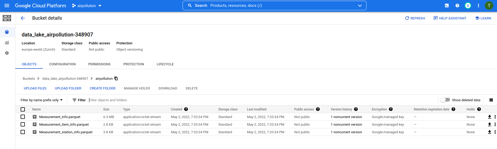

# air pollution project

## introduction
This is the final project of the data engineering zoomcamp (https://github.com/DataTalksClub/data-engineering-zoomcamp).
As part of the project, I created a datapipeline that loads and processes data from kaggle concerning the air pollution 
in Seoul. The data can be found here: https://www.kaggle.com/datasets/bappekim/air-pollution-in-seoul. 

The dataset provides hourly average values for six pollutants (SO2, NO2, CO, O3, PM10, PM2.5) between 2017 and 2019 for
25 districts in Seoul, South Korea. The data is divided into 3 files. The first files contains the average measurements, 
the second file contains information concerning the six pollutants and the last file covers the different measurement
stations. The details can be found on kaggle.

The idea of the project is to create a pipeline that fetches, stores and visualizes the data in an automated fashion. 
This enables an easy check and comparison concerning the air quality in the different districts. And lets us answer 
questions like, is one district more polluted than another, or which pollutant are an issue in Seoul? 

Unfortunately, I did not find an API to that provides this data on a continuous basis. Therefore, I fetch the data 
from kaggle as one time operation. However, if an API would be available, the pipeline could be adjusted easily to
operate on a schedule.

## setup
1) The kaggle data API is used to fetch the data from kaggle. A detailed description and how to authenticate can be 
found here: https://www.kaggle.com/docs/api. To run the project, it is required to create the environmental variables
KAGGLE_USER and KAGGLE_KEY. I stored them in a ".env" file in the airflow folder together with AIRFLOW_UID.
2) Terraform is used to create two buckets, a dataproc cluster and a bigquery data warehouse in the google cloud. 
Therefore, a google cloud project and a service account have to be created. The project name has to be adjusted in 
variables.tf. Besides, the key of the service account has to be downloaded as json and needs to be linked
in variables.tf as "credentials". The service account should have the following roles: BigQuery Admin, Dataproc 
Administrator, Editor, Storage Admin and Storage Object Admin. Subsequently, the resources can be created with the 
terraform commands:
`terraform init`
`terraform plan`
`terraform apply`

    More details can be found in the youtube videos of the course: 
https://www.youtube.com/watch?v=Hajwnmj0xfQ&list=PL3MmuxUbc_hJed7dXYoJw8DoCuVHhGEQb&index=10 and
https://www.youtube.com/watch?v=dNkEgO-CExg&list=PL3MmuxUbc_hJed7dXYoJw8DoCuVHhGEQb&index=11
3) For the data pipeline, a local airflow setup with docker-compose is used. To run it, the following environmental 
variables need to be adjusted at the top of the docker-compose file: GOOGLE_APPLICATION_CREDENTIALS, 
AIRFLOW_CONN_GOOGLE_CLOUD_DEFAULT, GCP_PROJECT_ID, GCP_GCS_BUCKET and GCP_GCS_BUCKET_CLUSTER. The steps of the dag can 
be seen here:

First, the kaggle data api is installed, then the data is fetched from kaggle and the csv files are transformed into
parquet files which are uploaded to GCS. Subsequently, google cloud SDK is authenticated, the pyspark script is 
uploaded and the pyspark job is submitted to the dataproc server. In the pyspark job the three files fetched from kaggle
are joined and finally written to BigQuery. At the end, a partitioned BigQuery table is created from the initial one and
the temporary files are deleted from the airflow worker.
To give you an idea of how it looks on GC, here are some screenshots:

To start the docker-compose, use the following commands:
`docker-compose build`
`docker-compose up airflow-init`
`docker-compose up`
   Details on the setup can be found in the course: 
https://github.com/DataTalksClub/data-engineering-zoomcamp/tree/main/week_2_data_ingestion/airflow
4) Finally, I created a dashboard to visualize the data. The results can be seen here:

